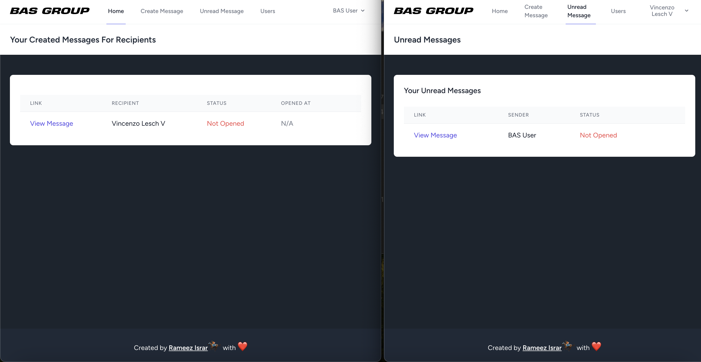

# Secret Message Application

This is a simple Laravel based application that allows users to create and share secure secret links.
User can open the link once if the link is not expired.

## Watch the demo
[Click here to watch the demo video](public/images/video.mp4)


## Tech Stack
- PHP
- Laravel
- TailwindCSS
- MySQL

## Features
- App uses User seeders that will create 5 random users along with another 'BAS' user
  with the email: 'bas@gmail.com'.
- All the users have the same password for simplicity: **password**
- Seeders can be found inside the seeders directory
- It can be run with Homestead/Vagrant or with Docker

## Installation

1. Clone the repository:

```bash
git clone https://github.com/alpharameeztech/secret-message.git
cd secret-message-app
```

## Run with Docker
- Just run the following command
```bash
docker-compose up --build
````
**Note:**The above command will build a docker image based on Dockerfile.
This will also run the required seeders and the app can be accessed on the
8080 port.

URL:
http://127.0.0.1:8080/

Go to the login page and the following credentials:

```
email: bas@gmail.com
password: password
```
This will log you in the app.

## Run without Docker
- Just run the following command
```bash
composer install
cp .env.example .env
php artisan migrate
php artisan db:seed
php artisan serve
yarn install
yarn run dev
````

- Make sure your MYSQL env variables are correct i.e
```
DB_CONNECTION=mysql
DB_HOST=127.0.0.1
DB_PORT=3306
DB_DATABASE=laravel
DB_USERNAME=root
DB_PASSWORD=root
```

URL:
http://127.0.0.1:8000/

**Note:** the URL can be different depending on your local setup.

## Prerequisites
Before you begin, make sure you have the following tools installed:
- [Docker](https://www.docker.com/)
- [Docker Compose](https://docs.docker.com/compose/)

## Screenshots




